# Cover Page

## Software Requirements Specification (SRS)

### Project
E-Wallet Microservices Platform

### Document Type
Academic Project Documentation / SRS

### Prepared For
Project evaluation, technical review, and implementation reference

### Repository
`E_Wallet-main`

### Technology Stack
React, Vite, Spring Boot, Spring Cloud, MySQL, ActiveMQ

### Revision
Version 1.1

### Date
09 April 2026

### Document Control

| Item | Value |
| --- | --- |
| Document Name | Software Requirements Specification |
| Version | 1.1 |
| Status | Draft for project documentation |
| Project Type | Full-stack microservices application |
| Frontend | React |
| Backend | Spring Boot microservices |
| Messaging | ActiveMQ |
| Database | MySQL |

---

# Index

1. [Introduction](#1-introduction)
2. [Problem Statement](#2-problem-statement)
3. [Project Overview](#3-project-overview)
4. [Objectives](#4-objectives)
5. [Stakeholders and User Roles](#5-stakeholders-and-user-roles)
6. [System Architecture](#6-system-architecture)
7. [Service Catalog](#7-service-catalog)
8. [Frontend Modules](#8-frontend-modules)
9. [Functional Requirements](#9-functional-requirements)
10. [Key Business Flows](#10-key-business-flows)
11. [Data and Persistence Requirements](#11-data-and-persistence-requirements)
12. [External Interface Requirements](#12-external-interface-requirements)
13. [Non-Functional Requirements](#13-non-functional-requirements)
14. [Assumptions and Constraints](#14-assumptions-and-constraints)
15. [Deployment Overview](#15-deployment-overview)
16. [Future Enhancement Opportunities](#16-future-enhancement-opportunities)
17. [Conclusion](#17-conclusion)

---

# Software Requirements Specification (SRS)

## Project Title
E-Wallet Microservices Platform

## 1. Introduction

### 1.1 Purpose
This document describes the Software Requirements Specification for the E-Wallet project implemented in this repository. It defines the problem being solved, the project scope, the system architecture, the microservices involved, the functional and non-functional requirements, and the deployment assumptions for development and local execution.

### 1.2 Intended Audience
- Project guides and evaluators
- Developers and maintainers
- Test engineers
- DevOps and deployment engineers
- Stakeholders reviewing the system design

### 1.3 Scope
The project is a digital wallet platform built with a React frontend and a Spring Boot microservices backend. It supports user onboarding, authentication, multi-factor authentication, wallet balance management, linked bank account management, intra-user transfers, user-to-user wallet transfers, transaction history, admin user management, service discovery, API routing, and asynchronous event propagation using ActiveMQ.

## 2. Problem Statement

Traditional payment and wallet applications often suffer from tightly coupled modules, poor transaction visibility, weak extensibility, and limited resilience when individual subsystems fail. A modern wallet platform must:

- allow secure user registration and login
- support wallet-based payments and bank-linked funding flows
- maintain transaction history and auditability
- support role-based administration
- remain modular and scalable
- tolerate temporary failure of non-critical subsystems such as history processing

This project addresses that problem by implementing a microservices-based e-wallet platform where security, wallet operations, user management, and transaction history are separated into independently deployable services.

## 3. Project Overview

### 3.1 Product Summary
The E-Wallet platform is a web-based financial application that allows users to:

- create an account
- sign in as a user or admin
- enable or disable MFA
- view wallet balance
- add and manage linked bank accounts
- add money to the wallet
- transfer funds between linked accounts
- send wallet funds to other users
- view and email transaction history

Administrators can:

- log in separately
- view registered users
- inspect user details
- enable or disable MFA for users
- block or unblock user accounts

### 3.2 Technology Summary
- Frontend: React, Vite, React Router, Bootstrap, Framer Motion
- Backend: Spring Boot, Spring Cloud, Spring Security, Spring Data JPA
- Service Discovery: Eureka
- Gateway: Spring Cloud Gateway
- Messaging: ActiveMQ
- Database: MySQL
- Authentication: JWT with optional MFA using TOTP

### 3.3 Project Snapshot

| Item | Description |
| --- | --- |
| Domain | Digital wallet and payment management |
| Architecture | Microservices with API Gateway and Eureka |
| Primary Users | End users and administrators |
| Core Functions | Authentication, wallet operations, linked account management, transfers, history |
| Async Backbone | ActiveMQ queues for registration and wallet events |
| Frontend Stack | React + Vite |
| Backend Stack | Spring Boot + Spring Cloud |
| Datastore | MySQL with service-owned schemas |

## 4. Objectives

- Provide a secure digital wallet platform for end users
- Demonstrate a microservices architecture with service discovery and API gateway routing
- Use asynchronous messaging for loose coupling between services
- Support admin oversight and user account governance
- Maintain transaction history as an auditable process record
- Enable local development without container dependencies

## 5. Stakeholders and User Roles

### 5.1 End User
An end user can sign up, log in, manage linked accounts, fund the wallet, transfer funds, view process history, and manage profile and MFA settings.

### 5.2 Administrator
An admin can sign in via the admin login flow, review users, inspect account details, and enforce controls such as blocking users or toggling MFA availability.

### 5.3 Developer / Maintainer
Developers run the system locally, maintain the services, update APIs, and manage cross-service communication.

### 5.4 Use Case Overview

#### 5.4.1 End User Use Cases

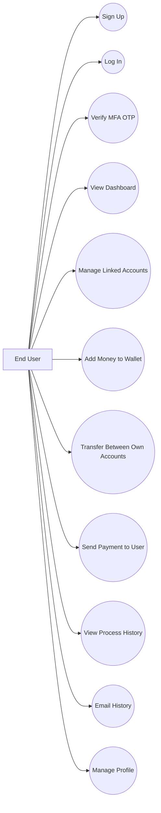

#### 5.4.2 Administrator Use Cases

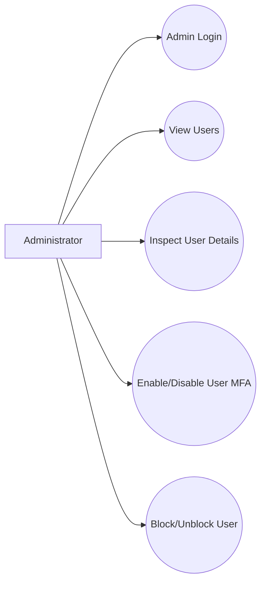

## 6. System Architecture

### 6.1 Architectural Style
The project follows a microservices architecture with:

- a dedicated frontend client
- an API gateway as the single entry point for browser requests
- a Eureka service registry for service discovery
- separate backend services for auth, users, wallet, and transaction history
- asynchronous messaging with ActiveMQ
- MySQL persistence with separate databases per business service

### 6.2 High-Level Components

1. React Frontend
2. API Gateway
3. Service Registry
4. Auth Service
5. User Service
6. Wallet Service
7. Transaction Service
8. ActiveMQ Broker
9. MySQL Database

### 6.2.1 Component Table

| Component | Type | Primary Responsibility |
| --- | --- | --- |
| React Frontend | Client | User and admin interface |
| API Gateway | Infrastructure | Request routing and CORS handling |
| Service Registry | Infrastructure | Service discovery |
| Auth Service | Business Service | Login, signup orchestration, JWT, MFA |
| User Service | Business Service | User records, profile, admin controls |
| Wallet Service | Business Service | Wallet balance and linked account operations |
| Transaction Service | Business Service | Transaction history persistence and email |
| ActiveMQ | Messaging Infrastructure | Asynchronous event transport |
| MySQL | Data Infrastructure | Persistent storage |

### 6.2.2 System Architecture Diagram

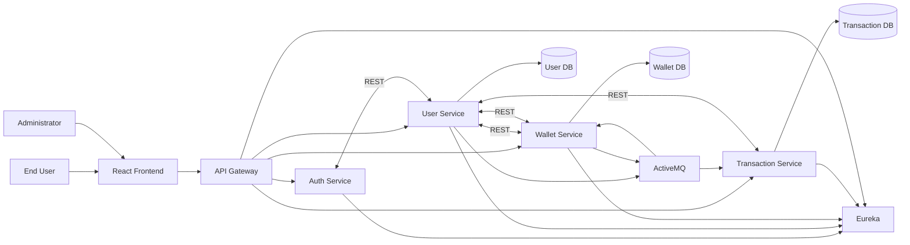

### 6.3 Communication Model

#### Synchronous Communication
- Frontend -> API Gateway -> backend services
- Auth Service -> User Service
- User Service -> Wallet Service
- Wallet Service -> User Service
- Transaction Service -> Wallet Service and User Service where applicable

#### Asynchronous Communication
- `user-service` publishes user registration events
- `wallet-service` consumes user registration events to create wallets
- `wallet-service` publishes wallet operation events
- `transaction-service` consumes wallet operation events to build transaction history

### 6.3.1 Communication Summary Table

| Source | Destination | Mode | Purpose |
| --- | --- | --- | --- |
| Frontend | API Gateway | Synchronous HTTP | All browser requests |
| API Gateway | Auth Service | Synchronous HTTP | Signup, login, MFA |
| API Gateway | User Service | Synchronous HTTP | Profile and admin operations |
| API Gateway | Wallet Service | Synchronous HTTP | Wallet and linked account operations |
| API Gateway | Transaction Service | Synchronous HTTP | History retrieval and history email |
| Auth Service | User Service | Synchronous HTTP | Credential and user lookup |
| User Service | ActiveMQ | Asynchronous JMS | New user event publication |
| ActiveMQ | Wallet Service | Asynchronous JMS | Wallet creation trigger |
| Wallet Service | ActiveMQ | Asynchronous JMS | Wallet operation event publication |
| ActiveMQ | Transaction Service | Asynchronous JMS | History persistence trigger |

### 6.4 Resilience Model
Wallet operations are executed in `wallet-service`, while `transaction-service` records history asynchronously. This allows core money movement to complete even if history processing is temporarily unavailable, with process history catching up when the transaction service recovers.

### 6.4.1 Resilience Flowchart

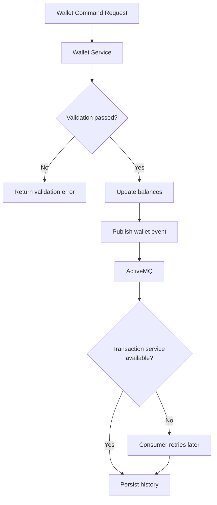

## 7. Service Catalog

### 7.0 Service Summary Table

| Service / Module | Port | Category | Main Responsibility |
| --- | --- | --- | --- |
| `service-registry` | `8761` | Infrastructure | Eureka discovery server |
| `api-gateway` | `8080` | Infrastructure | Browser-facing routing |
| `auth-service` | `8081` | Business | Authentication and MFA |
| `user-service` | `8082` | Business | Users, profiles, admin controls |
| `wallet-service` | `8083` | Business | Wallets, linked accounts, transfers |
| `transaction-service` | `8084` | Business | Transaction history and email |
| `local-activemq-broker` | `61616` | Development Utility | Local JMS broker for development runs |

### 7.1 Service Registry
- Service Name: `service-registry`
- Port: `8761`
- Responsibility: Eureka-based service discovery
- Purpose:
  - registers service instances
  - allows service lookup by logical name
  - supports inter-service routing via load-balanced URIs

### 7.2 API Gateway
- Service Name: `api-gateway`
- Port: `8080`
- Responsibility: central API entry point
- Purpose:
  - routes browser requests to backend services
  - manages CORS for frontend access
  - exposes health and gateway actuator endpoints

#### Gateway Route Summary
- `/signup`, `/auth/**` -> `auth-service`
- `/user/**`, `/admin/**` -> `user-service`
- `/accounts/**` -> `wallet-service`
- `/wallet/balance` -> `wallet-service`
- `/wallet/add`, `/wallet/add-from-account`, `/wallet/withdraw`, `/wallet/transfer/**` -> `wallet-service`
- `/transactions/**` -> `transaction-service`

| Route Pattern | Target Service |
| --- | --- |
| `/signup`, `/auth/**` | `auth-service` |
| `/user/**`, `/admin/**` | `user-service` |
| `/accounts/**` | `wallet-service` |
| `/wallet/balance` | `wallet-service` |
| `/wallet/add`, `/wallet/add-from-account`, `/wallet/withdraw`, `/wallet/transfer/**` | `wallet-service` |
| `/transactions/**` | `transaction-service` |

### 7.3 Auth Service
- Service Name: `auth-service`
- Port: `8081`
- Responsibility: authentication and MFA
- Purpose:
  - user signup orchestration
  - user and admin login
  - JWT generation
  - MFA setup and status checks
  - OTP verification

#### Main APIs
- `POST /signup`
- `POST /auth/login`
- `POST /auth/login/user`
- `POST /auth/login/admin`
- `POST /auth/enable-mfa`
- `POST /auth/disable-mfa`
- `GET /auth/mfa-status`
- `POST /auth/verify-otp`

### 7.4 User Service
- Service Name: `user-service`
- Port: `8082`
- Responsibility: user profile, admin control, internal user data
- Purpose:
  - create and manage users
  - store credentials and role data
  - support profile changes
  - expose admin user management
  - publish user registration events

#### Main User APIs
- `GET /user/details`
- `PUT /user/change-email`
- `PUT /user/change-password`

#### Main Admin APIs
- `GET /admin/users`
- `GET /admin/users/{userId}`
- `PUT /admin/users/{userId}/mfa`
- `PUT /admin/users/{userId}/blocked`

#### Internal APIs
- `POST /internal/users/register`
- `GET /internal/users/by-username/{username}`
- `PUT /internal/users/{userId}/mfa`
- `POST /internal/users/lookup`

### 7.5 Wallet Service
- Service Name: `wallet-service`
- Port: `8083`
- Responsibility: wallet and linked bank account operations
- Purpose:
  - maintain wallet balance
  - manage linked bank accounts
  - support bank-to-wallet funding
  - support wallet withdrawals
  - support linked-account self-transfer
  - support wallet-to-wallet user transfer
  - publish wallet operation events
  - create wallets when new users register

#### Public APIs
- `GET /accounts`
- `POST /accounts`
- `PUT /accounts/{accountId}`
- `DELETE /accounts/{accountId}`
- `GET /wallet/balance`
- `POST /wallet/add`
- `POST /wallet/add-from-account`
- `POST /wallet/withdraw`
- `POST /wallet/transfer/self`
- `POST /wallet/transfer/user`

#### Internal APIs
- `GET /internal/wallets/{userId}`
- `GET /internal/accounts/user/{userId}`
- `POST /internal/transactions/add-money`
- `POST /internal/transactions/add-from-account`
- `POST /internal/transactions/withdraw`
- `POST /internal/transactions/self-transfer`
- `POST /internal/transactions/wallet-transfer`

### 7.6 Transaction Service
- Service Name: `transaction-service`
- Port: `8084`
- Responsibility: transaction history and history email dispatch
- Purpose:
  - consume wallet operation events
  - persist transaction records
  - return process history for a user
  - email transaction history to the user

#### Main APIs
- `GET /transactions`
- `POST /transactions/email-history`

#### Notes
- The codebase still contains transaction command endpoints and a proxy-style command service, but the current API gateway routes wallet command requests to `wallet-service`. The transaction service is therefore primarily responsible for history persistence and reporting.

### 7.7 Local ActiveMQ Broker
- Module Name: `local-activemq-broker`
- Purpose: development-only in-project ActiveMQ startup option
- Port: `61616`
- Responsibility:
  - provides a lightweight local broker for development
  - supports asynchronous event exchange between services during local runs

## 8. Frontend Modules

The React frontend provides the following user-facing pages:

- `Login`
- `Signup`
- `Success`
- `MFA`
- `MFASetup`
- `Dashboard`
- `Accounts`
- `AddMoney`
- `Transfer`
- `Transactions`
- `Profile`
- `AdminLogin`
- `AdminUsers`

### 8.1 Frontend Page Table

| Page | Primary Purpose |
| --- | --- |
| `Login` | User authentication |
| `Signup` | New user registration |
| `Success` | Signup success confirmation |
| `MFA` | OTP verification |
| `MFASetup` | MFA enablement and QR setup |
| `Dashboard` | Wallet summary and overview |
| `Accounts` | Linked account management |
| `AddMoney` | Bank-to-wallet funding |
| `Transfer` | Self-transfer and wallet-to-user transfer |
| `Transactions` | Process history and history email |
| `Profile` | User profile maintenance |
| `AdminLogin` | Administrator authentication |
| `AdminUsers` | Admin monitoring and controls |

### 8.2 Major UI Capabilities
- dashboard overview with wallet status and recent activity
- linked bank account management with account PIN configuration
- wallet funding and self-transfer with visible account selection
- user-to-user wallet payment flow
- process history with latest-first sorting and exact date/time
- admin user inspection and access control management

## 9. Functional Requirements

### 9.1 User Registration and Authentication
- The system shall allow new users to sign up with name, email, phone, username, and password.
- The system shall prevent duplicate usernames.
- The system shall allow separate user and admin login flows.
- The system shall issue JWT access tokens for authenticated sessions.
- The system shall support MFA setup and OTP verification.
- The system shall deny login for blocked users.

### 9.2 Profile and Account Management
- The system shall allow users to view profile details.
- The system shall allow users to change email.
- The system shall allow users to change password.
- The system shall allow users to view, add, edit, and remove linked bank accounts.
- The system shall allow each linked bank account to have a 4-digit PIN.

### 9.3 Wallet Management
- The system shall create a wallet for a new user after registration.
- The system shall allow users to view wallet balance.
- The system shall allow direct wallet balance addition where supported by the API.
- The system shall allow users to move funds from linked bank accounts into the wallet.
- The system shall allow users to withdraw wallet funds to linked bank accounts.
- The system shall validate available balances before wallet operations complete.

### 9.4 Transfer Operations
- The system shall allow users to transfer funds between their own linked accounts.
- The system shall require the source account PIN for source-account operations.
- The system shall allow users to send wallet funds to another valid user.
- The system shall prevent transfers to blocked users.
- The system shall prevent transfers to admin accounts.

### 9.5 Transaction History
- The system shall record wallet operations as transaction records.
- The system shall display transaction history ordered by latest transaction first.
- The system shall show date and time for each transaction.
- The system shall allow users to request transaction history by email.
- The system shall keep wallet operations functional even if the history service is temporarily unavailable, with history synchronized later.

### 9.6 Admin Functions
- The system shall provide a dedicated admin login flow.
- The system shall allow admins to list users.
- The system shall allow admins to inspect user details.
- The system shall allow admins to enable or disable MFA for users.
- The system shall allow admins to block or unblock user accounts.
- The system shall prevent admin user records from being managed through standard user-control endpoints intended only for non-admin accounts.

## 10. Key Business Flows

### 10.0 Workflow Overview Diagram

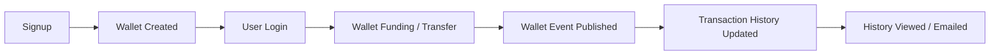

### 10.1 Signup Flow
1. User submits signup request through frontend.
2. API Gateway routes the request to Auth Service.
3. Auth Service delegates user creation to User Service.
4. User Service stores the user record and role.
5. User Service publishes a `USER_REGISTERED_QUEUE` event.
6. Wallet Service consumes the event and creates the wallet.

#### 10.1.1 Signup Sequence Diagram

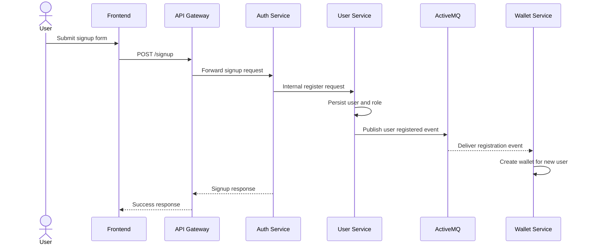

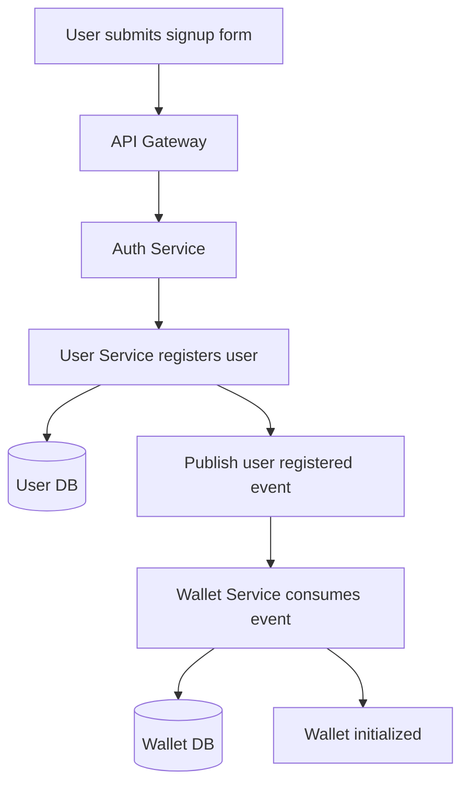

### 10.2 Login Flow
1. User submits login credentials.
2. Auth Service retrieves the internal user record from User Service.
3. Credentials are validated.
4. If MFA is disabled, an access token is returned.
5. If MFA is enabled, a temporary MFA token is returned.
6. OTP verification generates the final access token.

#### 10.2.1 Login and MFA Sequence Diagram

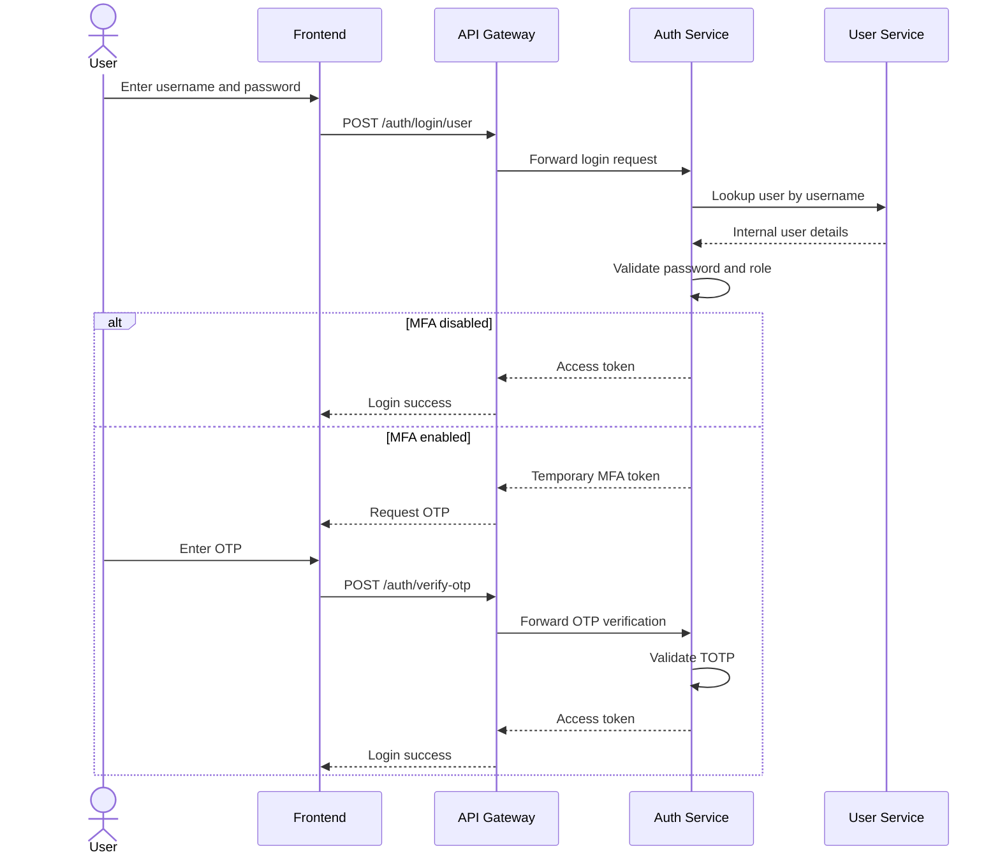

### 10.3 Add Money from Linked Account
1. User selects a linked account and enters amount and source PIN.
2. Wallet Service validates account ownership, PIN, and source balance.
3. Wallet balance is increased and account balance is reduced.
4. Wallet Service publishes a wallet operation event.
5. Transaction Service consumes the event and stores history.

#### 10.3.1 Add Money Sequence Diagram

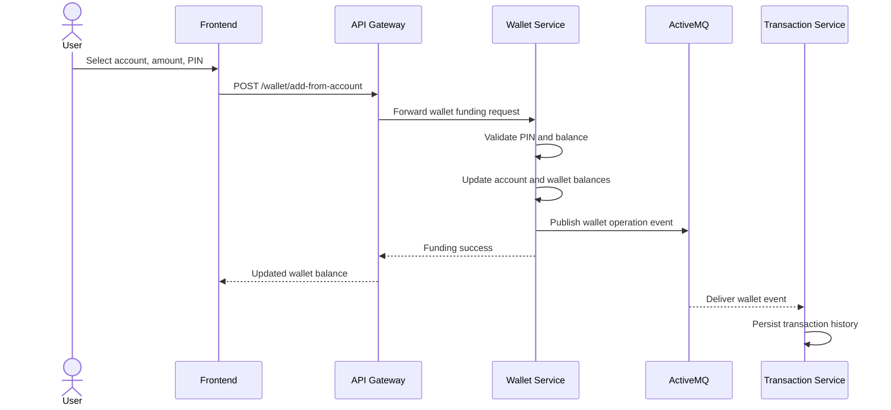

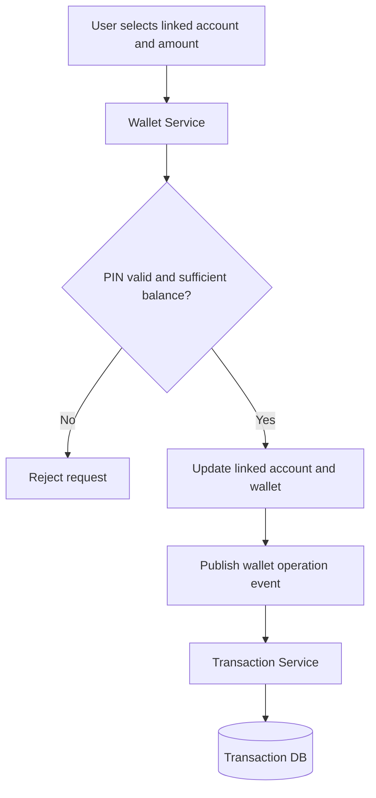

### 10.4 Self Transfer Between Linked Accounts
1. User selects source and destination linked accounts.
2. User enters amount and source account PIN.
3. Wallet Service validates PIN and source balance.
4. Source account balance is reduced and destination account balance is increased.
5. Wallet Service publishes the transaction event.
6. Transaction Service records the process history asynchronously.

#### 10.4.1 Self Transfer Sequence Diagram

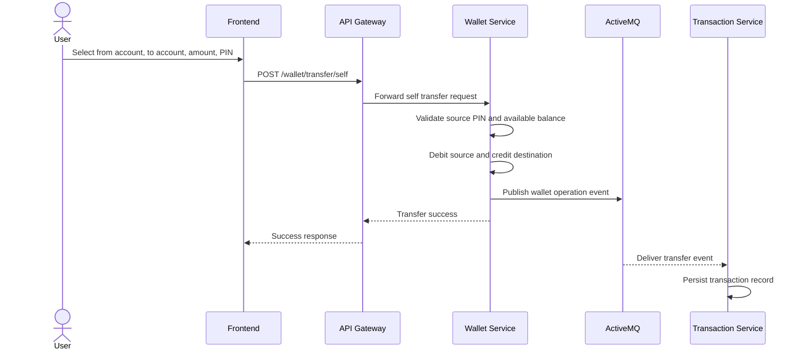

### 10.5 Wallet Payment to Another User
1. User enters recipient username and amount.
2. Wallet Service resolves the recipient through User Service.
3. Wallet Service validates sender balance and recipient eligibility.
4. Sender wallet is debited and receiver wallet is credited.
5. Wallet Service publishes the operation event.
6. Transaction Service stores sender and receiver history records.

#### 10.5.1 Wallet Payment Sequence Diagram

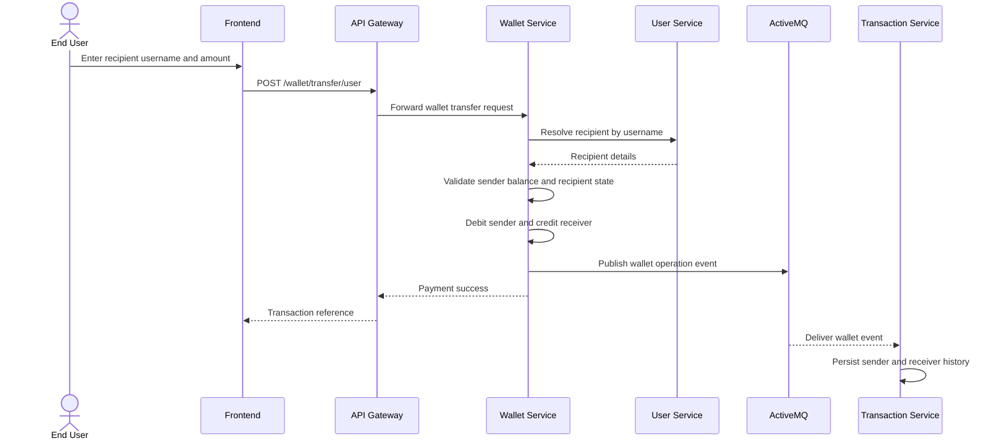

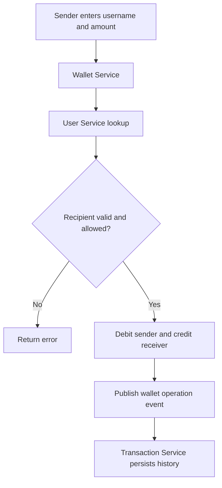

## 11. Data and Persistence Requirements

### 11.1 Databases
The system uses MySQL with separate logical databases per service:

- `ewallet_user`
- `ewallet_wallet`
- `ewallet_transaction`

### 11.1.1 Data Ownership Table

| Service | Main Persistent Entities / Records |
| --- | --- |
| User Service | Users, roles, MFA data, blocked status |
| Wallet Service | Wallet balances, linked bank accounts, account PIN hash |
| Transaction Service | Transaction records and history metadata |

### 11.1.2 ER Diagram - User Service

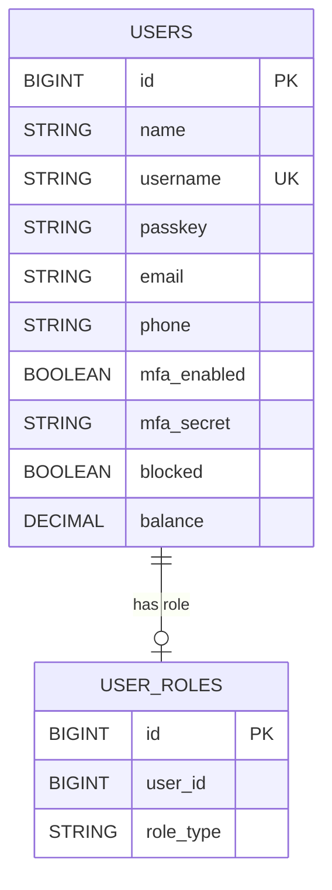

### 11.1.3 ER Diagram - Wallet Service

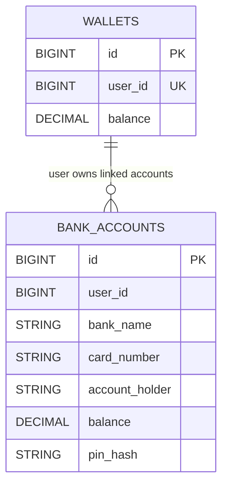

### 11.1.4 ER Diagram - Transaction Service

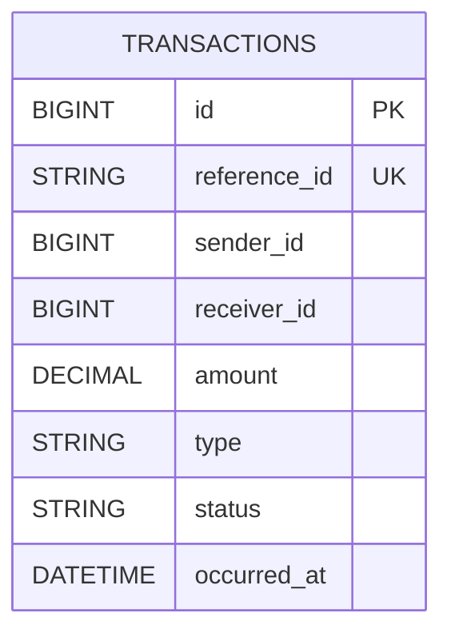

### 11.1.5 Logical Cross-Service Data Relationship Diagram

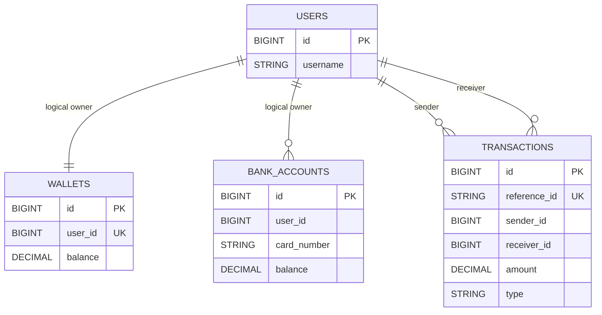

Note: the cross-service relationships above are logical business relationships. Because the project uses service-owned databases, foreign keys are not enforced across services at the database level.

### 11.2 Persistence Responsibilities
- User Service stores user and role data
- Wallet Service stores wallet balances and linked bank accounts
- Transaction Service stores transaction records

### 11.3 Data Integrity Expectations
- Usernames shall be unique
- Transaction reference IDs shall be unique
- Wallet and account balances shall be stored as decimal monetary values
- PINs for linked bank accounts shall not be returned in API responses

## 12. External Interface Requirements

### 12.1 Frontend Interface
- Browser-based React application
- Default local frontend URL: `http://localhost:5173`

### 12.2 Service Interface
- REST APIs over HTTP
- JWT bearer token authentication for protected endpoints

### 12.3 Messaging Interface
- ActiveMQ broker on `tcp://localhost:61616`

| Logical Queue | Physical Queue Name | Purpose |
| --- | --- | --- |
| `USER_REGISTERED_QUEUE` | `ewallet.user.registered.queue` | Notify wallet service of new user registration |
| `WALLET_OPERATION_QUEUE` | `ewallet.wallet.operation.queue` | Notify transaction service of wallet operations |

### 12.4 Email Interface
- SMTP configuration through `transaction-service`
- Used for sending transaction history emails

## 13. Non-Functional Requirements

### 13.1 Security
- Passwords shall be stored in encoded form
- JWT shall protect authenticated APIs
- MFA shall be available using TOTP
- Linked bank account source operations shall require PIN validation
- Admin and user flows shall be logically separated

### 13.2 Scalability
- Services shall be independently deployable
- Gateway and Eureka architecture shall support scaling of business services
- Event-based history processing shall reduce tight coupling

### 13.3 Availability and Fault Tolerance
- Core wallet commands should continue to operate when history processing is temporarily unavailable
- Services shall retry broker connections when ActiveMQ becomes available after downtime

### 13.4 Maintainability
- Business domains are split across dedicated services
- Each service owns its own persistence concerns
- API Gateway centralizes browser-facing routing

### 13.5 Usability
- The frontend shall provide clear user flows for signup, login, wallet funding, transfers, and history viewing
- The dashboard shall summarize the current state of user funds and security

## 14. Assumptions and Constraints

### 14.1 Assumptions
- Java 17 is available
- MySQL is available locally
- ActiveMQ is available through the in-project local broker or another local broker instance
- The frontend runs on `localhost:5173`

### 14.2 Constraints
- The system currently targets local development and demonstration usage
- Email history requires SMTP configuration in `transaction-service`
- Service startup order matters in local execution:
  - ActiveMQ
  - Service Registry
  - core business services
  - API Gateway
  - Frontend

## 15. Deployment Overview

### 15.1 Local Development Mode
- MySQL runs locally
- ActiveMQ can run using `local-activemq-broker`
- Backend services are started individually
- Frontend is started with Vite

### 15.2 Deployment Diagram

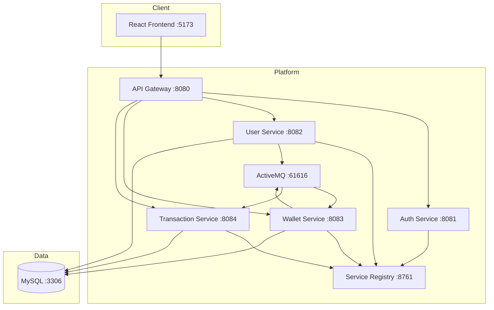

### 15.3 Default Local Ports

| Component | Port |
| --- | --- |
| Eureka | `8761` |
| API Gateway | `8080` |
| Auth Service | `8081` |
| User Service | `8082` |
| Wallet Service | `8083` |
| Transaction Service | `8084` |
| MySQL | `3306` |
| ActiveMQ Broker | `61616` |
| Frontend | `5173` |

## 16. Future Enhancement Opportunities

- production-grade observability and tracing
- stronger audit and reconciliation tooling
- payment gateway integration
- notification service for alerts and receipts
- finer-grained authorization rules
- API versioning and formal OpenAPI documentation
- test automation and load testing expansion

## 17. Conclusion

The E-Wallet project is a microservices-based digital wallet platform that demonstrates secure authentication, wallet management, linked account flows, admin governance, service discovery, API gateway routing, and asynchronous transaction history processing. The architecture is modular, development-friendly, and structured to support future extension toward more production-oriented capabilities.
